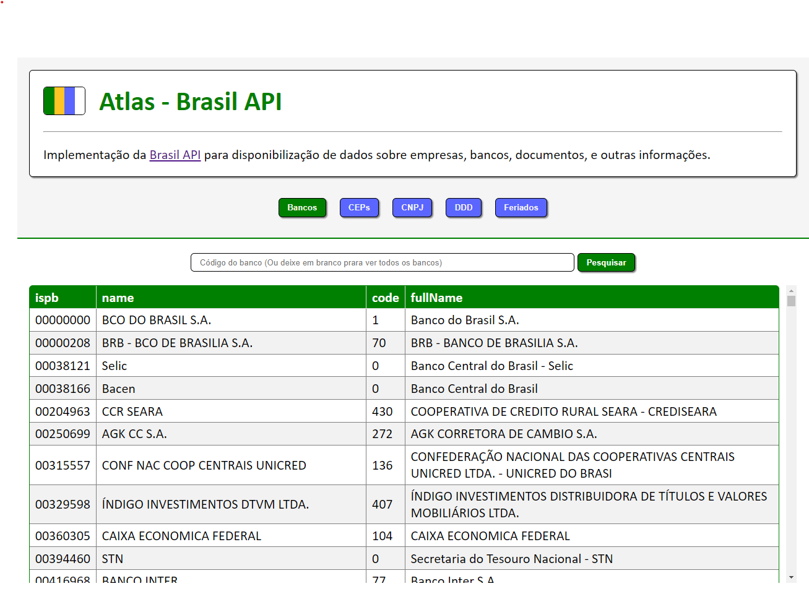

# Atlas - Brasil API

**Implementação da Brasil [Brasil API](https://brasilapi.com.br/) para disponibilização de dados sobre empresas, bancos, documentos, e outras informações.**

SPA desenvolvida como atividade do curso de Desenvolvimento WEB Full Stack da faculdade Unyleya, durante módulo de fundamentos WEB.

A itenção é aplicar a base das tecnologias CSS, JS para Frontend e consumo de API sem a utilização de frameworks ou bibliotecas de terceiros.

### Screenshot:

